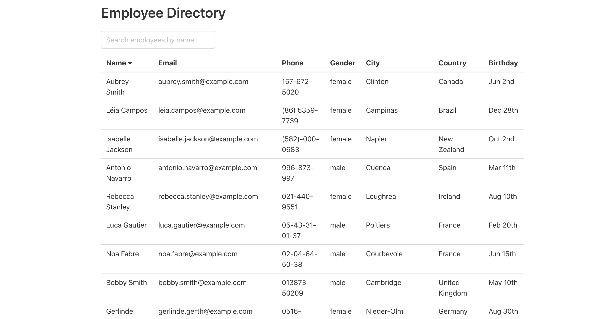

# React: Portfolio

## About This Assignment

For this assignment, I updated my portfolio page for recruiters, companies, and
hiring managers to view when they are scouting for software developer prospects. Hopefully, the page I created will provide them with much of the necessary information needed for them to consider me for a position. 

Mostly, I rewrote some of my code to utilize React instead of vanilla JavaScript. This involved using React components for the header, footer, project cards, etc... and using React Router to direct the viewer to different pages (Contact, Projects, About Me). 

## Links

Deployed website: https://charlispilecki.github.io/
Github Repo: https://github.com/charlispilecki/charlispilecki.github.io 
Linkedin: https://www.linkedin.com/in/charli-spilecki-1270979a/
Resume: https://charlispilecki.github.io/public/img/CharliSpileckiResume.pdf

## Screenshots

## Updated Screenshots

## Updated Screenshots 

## Updated Screenshots

