# 02 Advanced CSS: Portfolio

## About This Assignment

For this assignment, I updated my portfolio page for recruiters, companies, and
hiring managers to view when they are scouting for software developer jobs. Hopefully,
the page I created will provide them with much of the necessary information needed
for them to consider me for a position. 

I included sections titled "About Me," "Projects," and "Contact." For this updated portfolio, I included links to several of my most recent works and screenshots of the websites. 
I also added a link to the PDF version of my resume and a my Github profile link in the "Contact" section. 

More specifically:

For the HTML
* I added the Javascript component of Bootstrap simply to activate the navigation bar menu when in mobile mode
* Created image cards for the "Projects" and "Contact" section
* Added more cards for my second project and additional homeworks

For the CSS
* I utilized Bootstrap and Bulma to make formatting the webpage easier and more responsive; most
notably, the column and row classes, and many of my styling elements
* Sparingly utilized CSS for the body and footer formatting/styling and also to improve
some page and text spacing
* Hover and zoom function for the "Projects" section

## Links

Deployed website: https://charlixoxoxo.github.io/charlispilecki.github.io/
Github Repo: https://github.com/charlispilecki/charlispilecki.github.io 
Linkedin: https://www.linkedin.com/in/charli-spilecki-1270979a/
Resume: https://charlispilecki.github.io/public/img/CharliSpileckiResume.pdf

## Screenshots

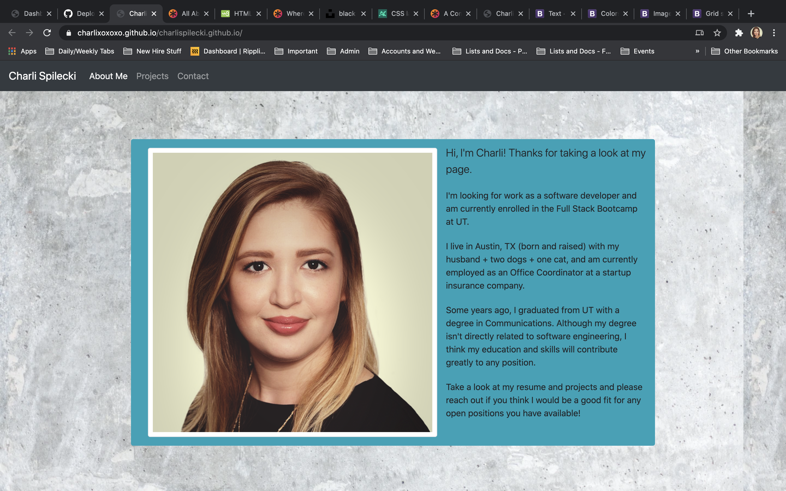

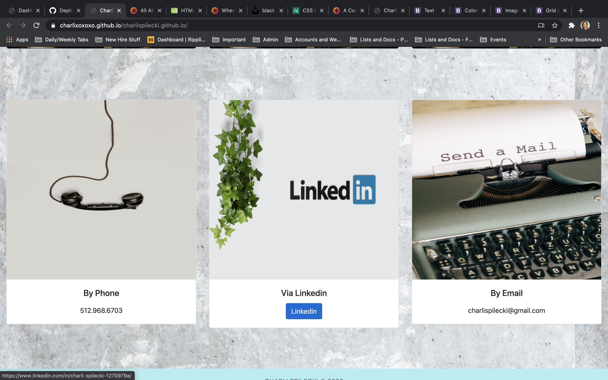
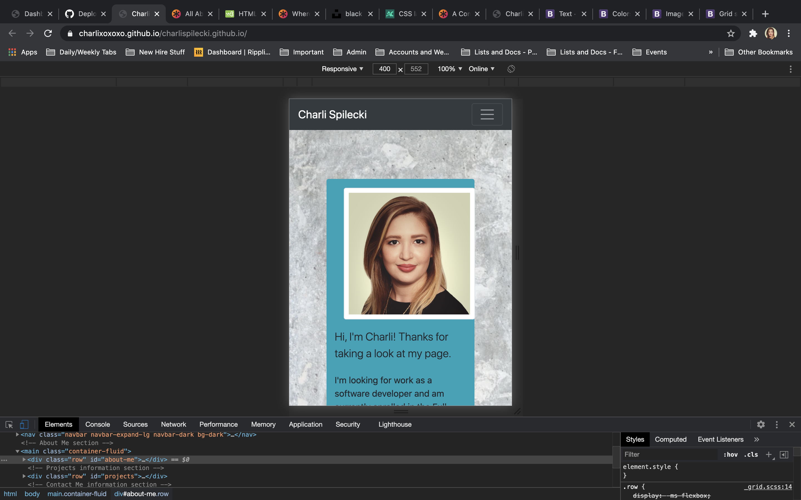
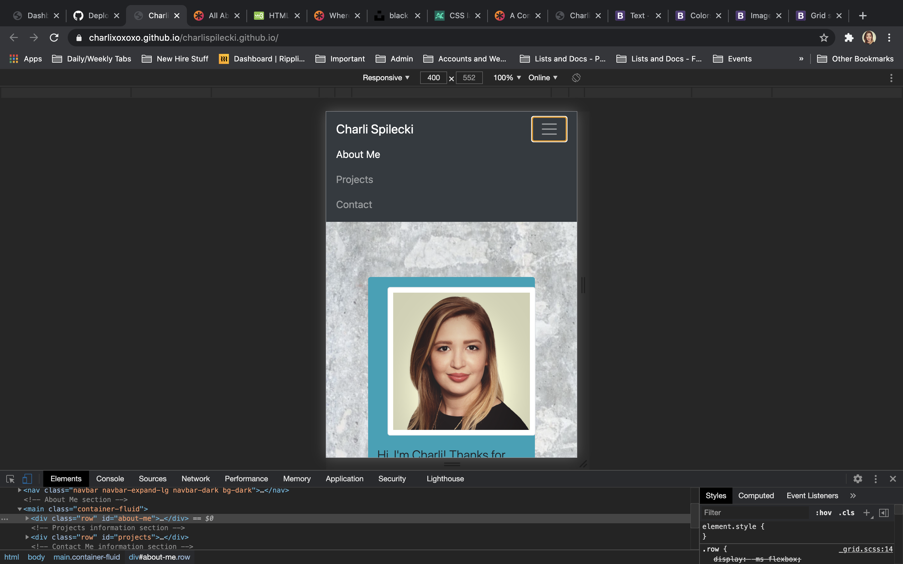
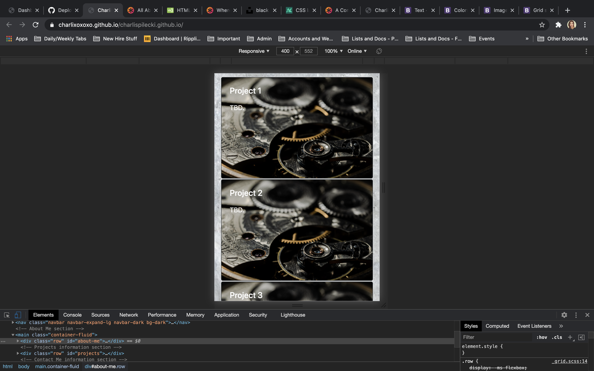
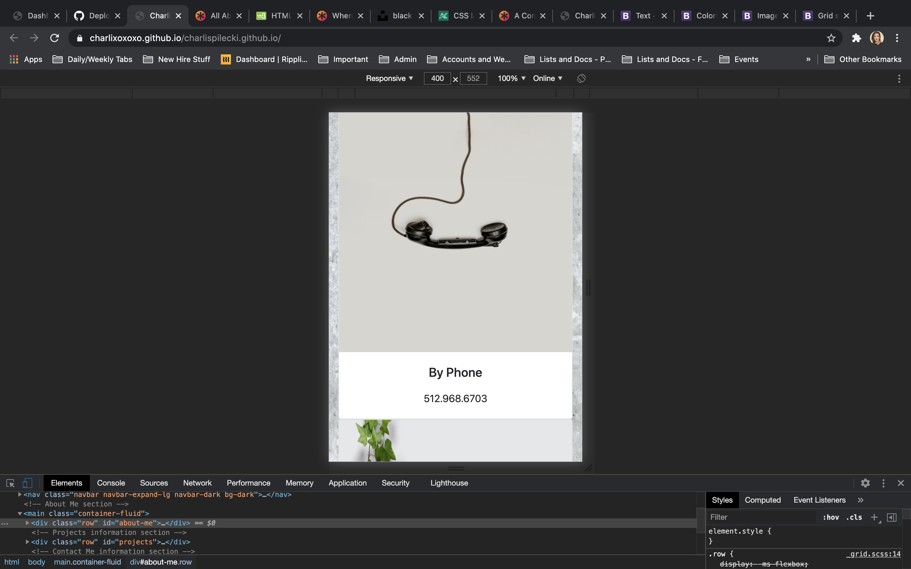
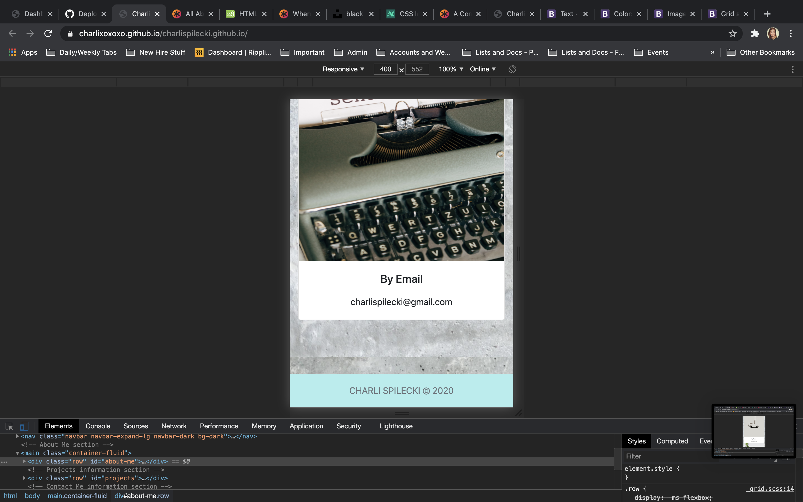

## Updated Screenshots

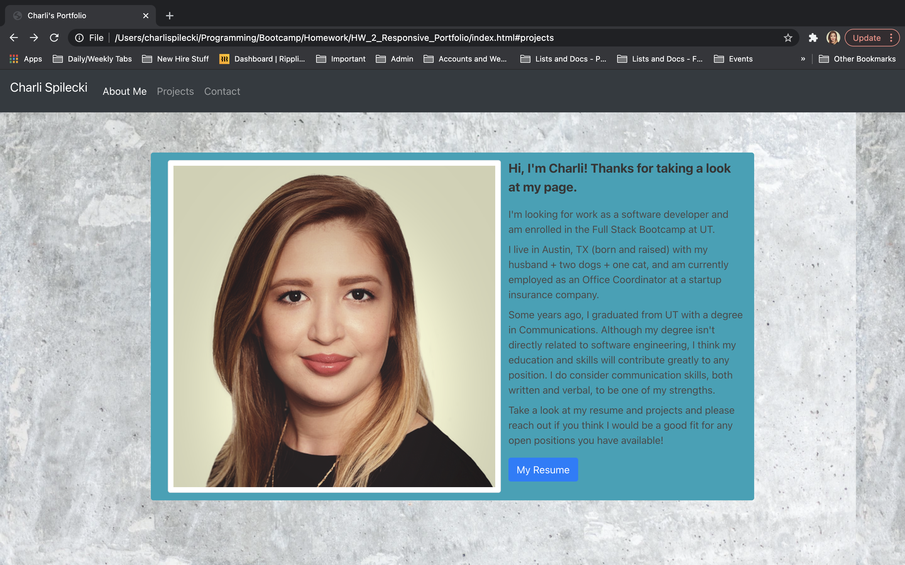

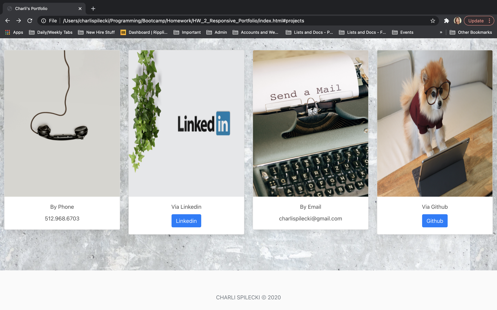

## Updated Screenshots 
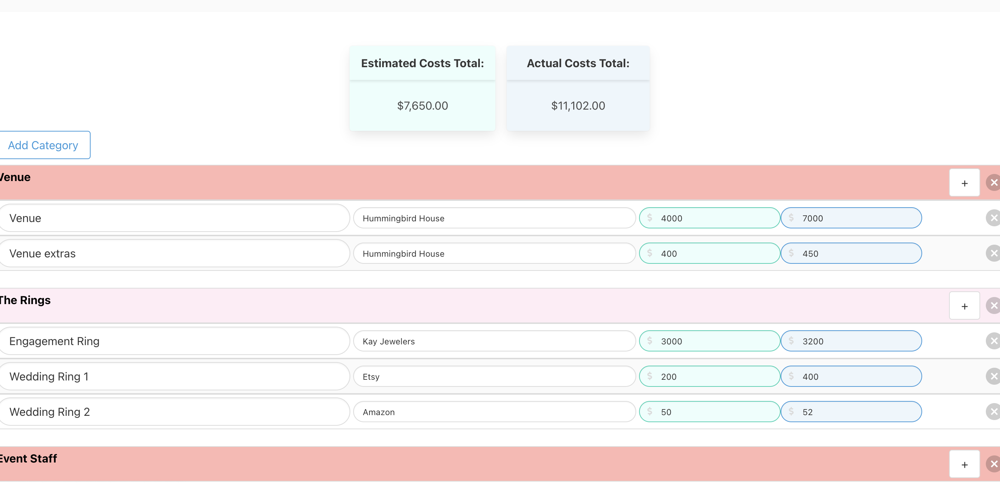
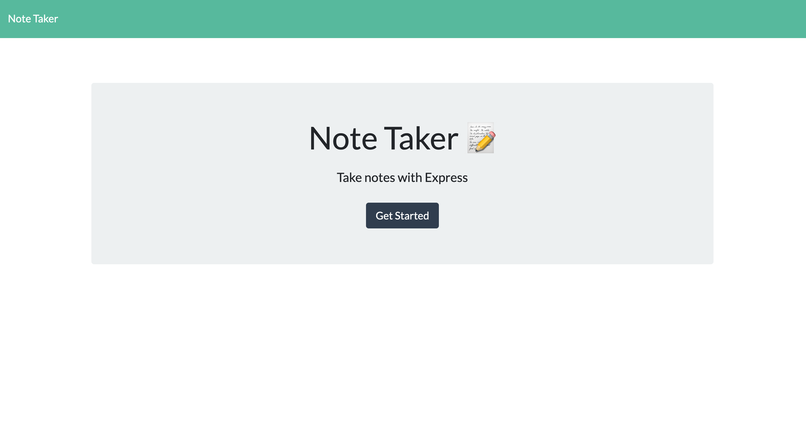

