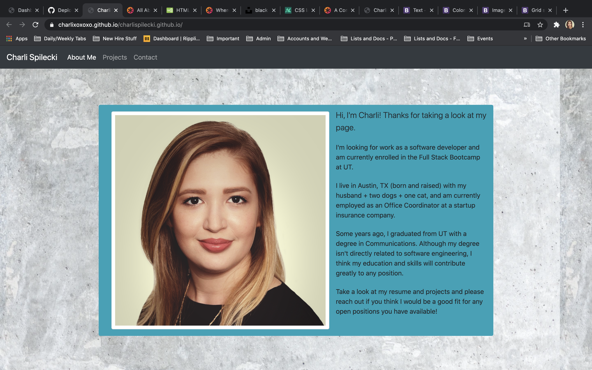
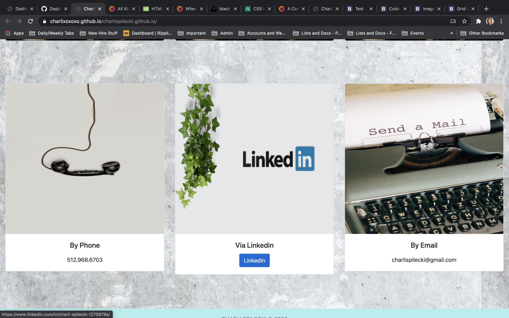
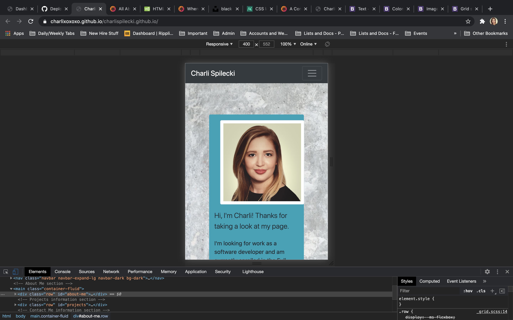
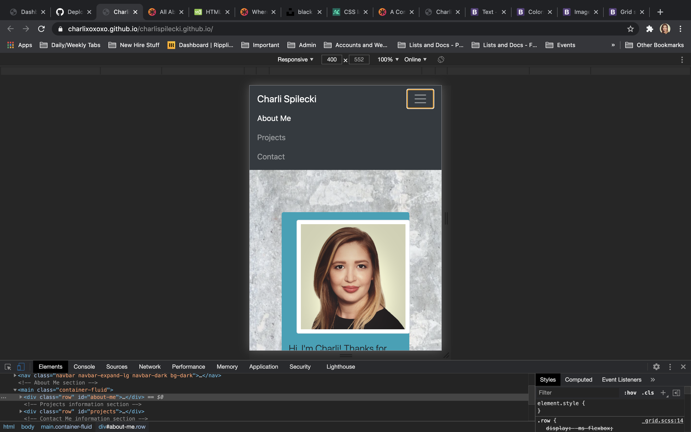
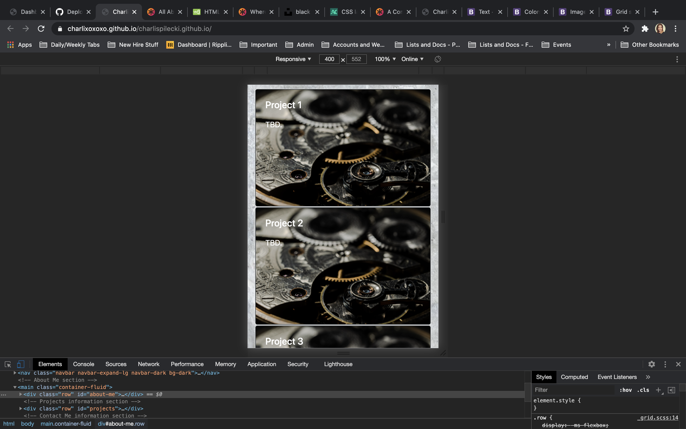
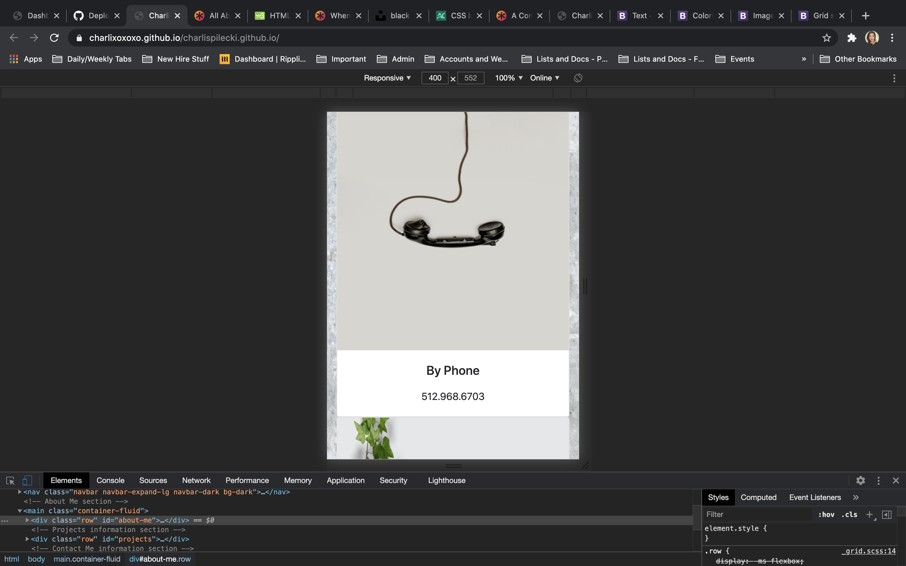
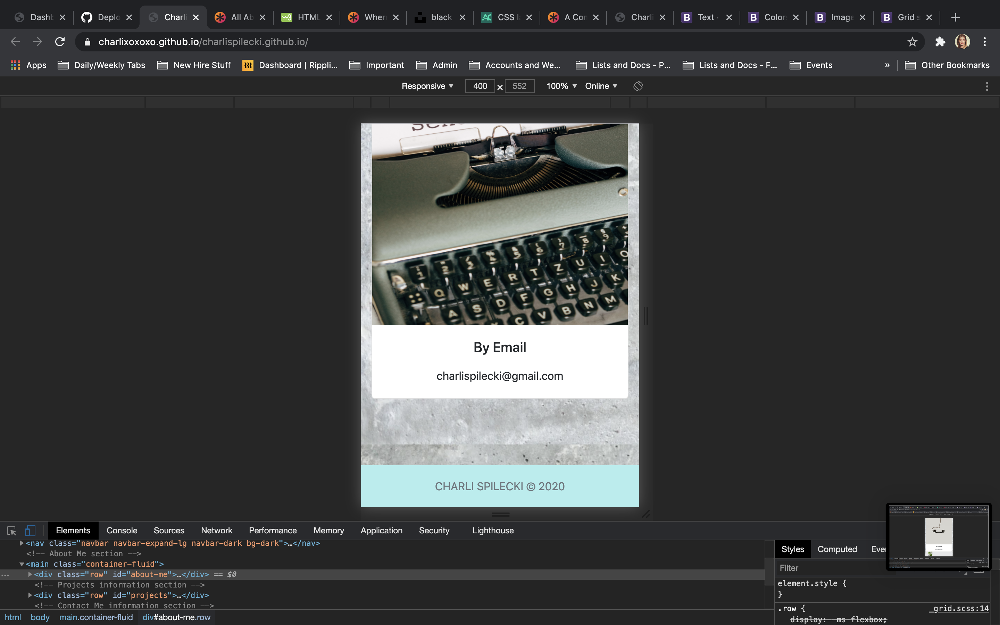
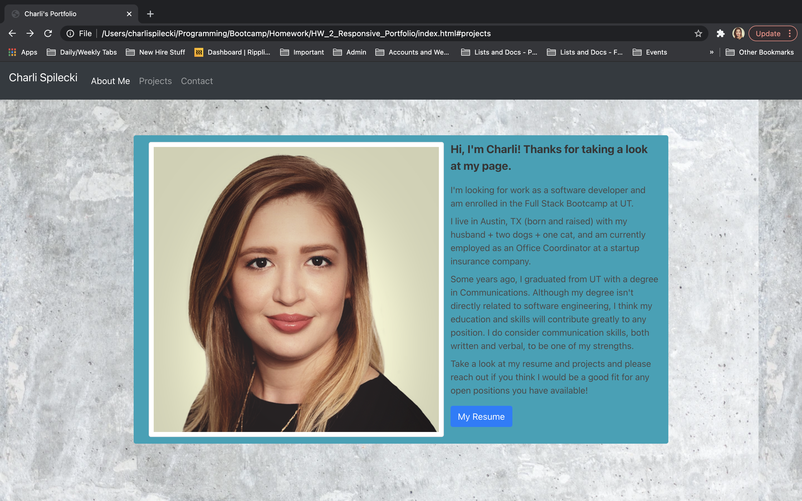
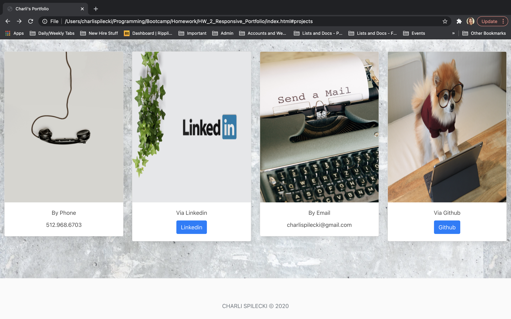

# 02 Advanced CSS: Portfolio

## About This Assignment

For this assignment, I created a portfolio page for recruiters, companies, and
hiring managers to view when they are scouting for software developer jobs. Hopefully,
the page I created will provide them with much of the necessary information needed
for them to consider me for a position. 

I included sections titled "About Me," "Projects," and "Contact." The
"Projects" section is very sparse and empty right now, but I will eventually have
projects I can add there. 

More specifically:

For the HTML
* I utilized Bootstrap to make formatting the webpage easier and more responsive; most
notably, the column and row classes, and many of my styling elements
* I also added the Javascript component of Bootstrap simply to activate the navigation
bar menu when in mobile mode
* Created image cards for the "Projects" and "Contact" section

For the CSS
* Sparingly utilized CSS for the body and footer formatting/styling and also to improve
some page and text spacing
* Hover and zoom function for the "Projects" section

## Link to Deployed Website

https://charlixoxoxo.github.io/charlispilecki.github.io/

## Screenshots

## Updated Screenshots

